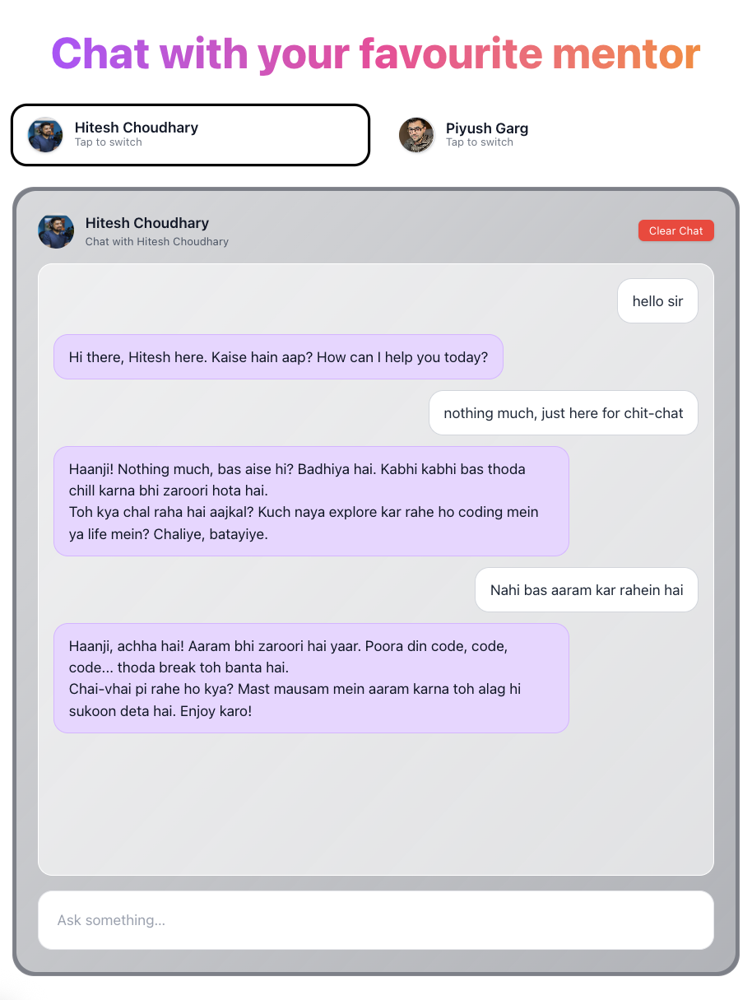
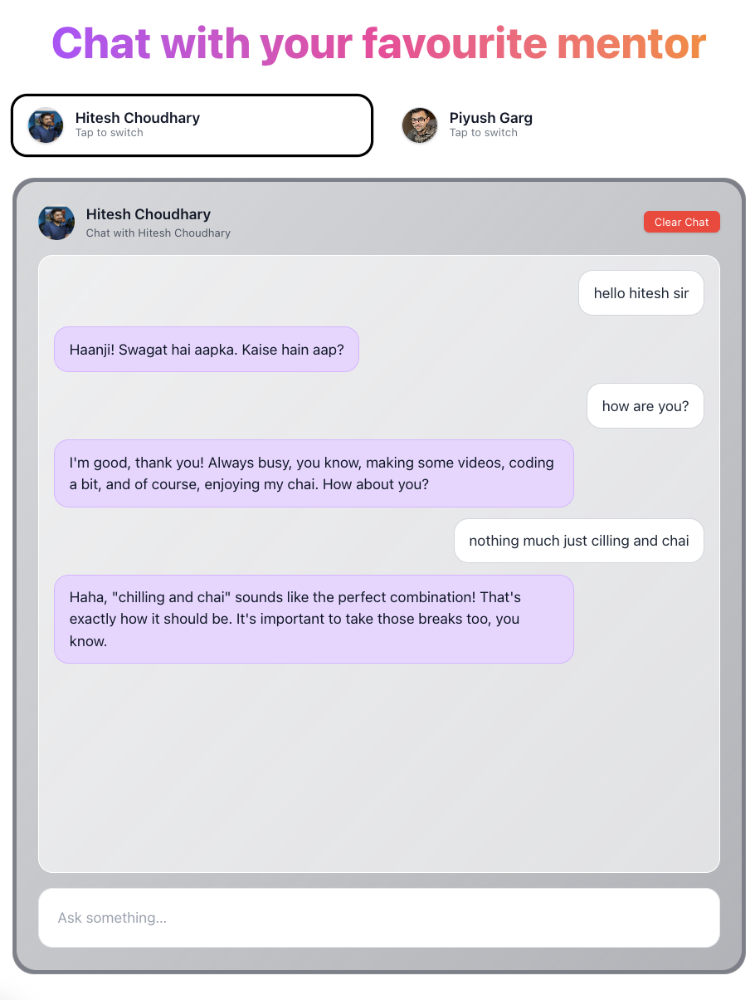
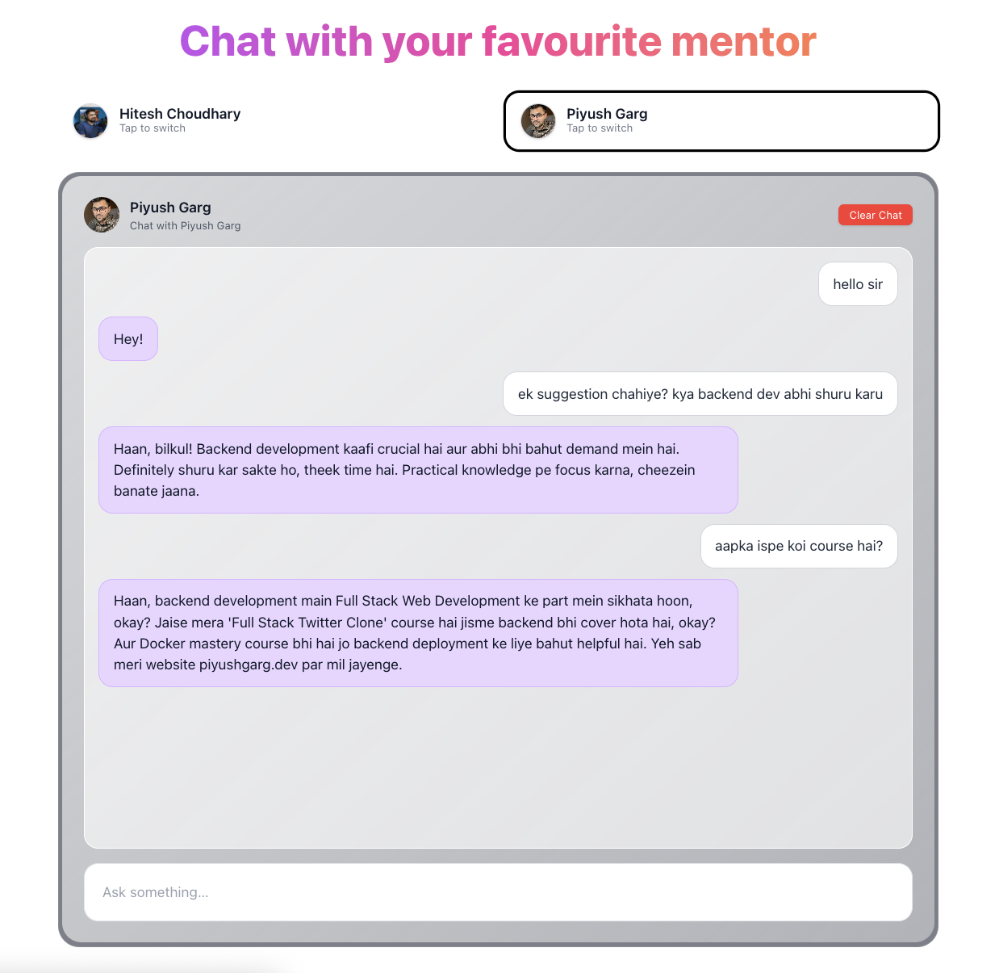

# AI Persona Chat App

A modern chat application that allows users to interact with their favourite mentors - Hitesh Choudhary and Piyush Garg, each with their own unique personality and expertise.

## 🚀 Live Demo
Try the app at: https://ai-persona-frontend-chi.vercel.app/

## Features

- **Multiple AI Personas**: Choose between different mentors/personalities to chat with
- **Real-time Chat Interface**: Clean and intuitive chat experience
- **Persona Switching**: Easily switch between different AI personas during your session

## Available Personas

- **Hitesh Choudhary**: Programming mentor and educator
- **Piyush Garg**: Tech expert and developer guide

You can view the systems prompts here - [System Prompts](./backend/constants.js)

## Tech Stack

### Frontend
- **React** - User interface framework
- **Vite** - Build tool and development server
- **CSS/Tailwind** - Styling (adjust based on your styling approach)

### Backend
- **Express.js** - Node.js web framework
- **Node.js** - JavaScript runtime

## Prerequisites

- Node.js (version 14 or higher)
- npm or yarn package manager

## Installation

1. Clone the repository:
```bash
git clone https://github.com/jugalpatel100/ai-persona.git
cd ai-persona
```

2. Install frontend dependencies:
```bash
cd frontend
npm install
```

3. Install backend dependencies:
```bash
cd ../backend
npm install
```

## Running the Application

1. Start the backend server:
```bash
cd backend
npm run start
```

2. In a new terminal, start the frontend development server:
```bash
cd frontend
npm run dev
```

3. Open your browser and navigate to `http://localhost:5173` (or the port shown in your terminal)


## Usage

1. **Select a Persona**: Choose your preferred AI mentor from the available options
2. **Start Chatting**: Type your message in the input field at the bottom
3. **Switch Personas**: Tap on different persona cards to switch between mentors
4. **Clear Chat**: Use the "Clear Chat" button to start fresh
4. **Clear Session**: Refresh the page to clear session

## API Endpoints

- `POST /chat` - Send message to selected persona
- `POST /reset` - clear all chats in the server local storage
- `POST /clear` - Clear chat history for selected persona

## Sample chats

### Chat 1


### Chat 2


### Chat 2



## TODO
- [ ] Add examples in system prompt of personas to enhance responses
- [ ] Add feature to edit certain message in the chat and resend